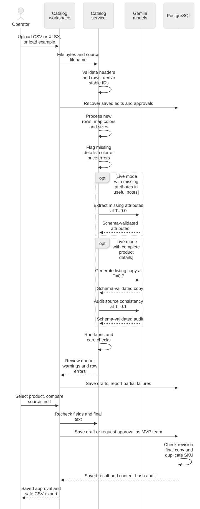
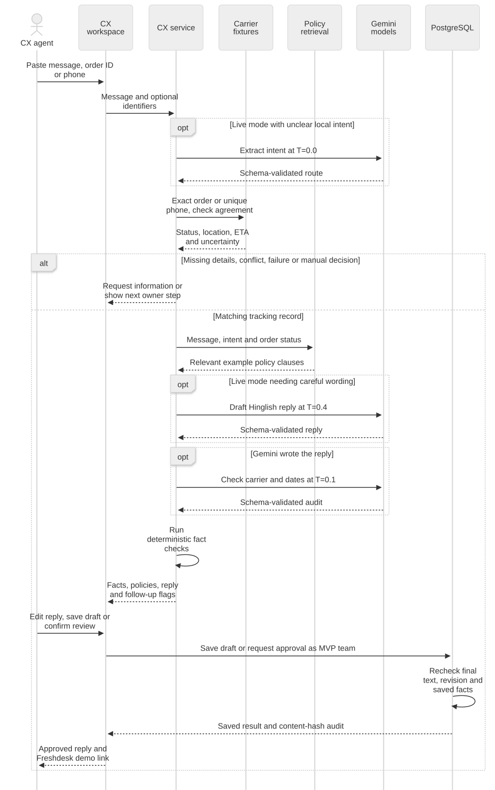

# Dhaga Ops architecture and data design

## High-level design

The MVP is a single Python application with a guided Streamlit operator interface and a service layer. It opens directly without an app password, login, sign-out or reviewer-name form. The sidebar provides workspace navigation. Overview numbers open their corresponding filtered queues, rather than displaying counts without a next action. Catalog review uses one selected product; CX places the editable reply beside source order facts. A separate HTTP API is not needed for these synchronous workflows. Vercel hosts the Streamlit container and PostgreSQL holds shared workflow state.

Unsaved editor content belongs to the Streamlit session. `disconnectedSessionTTL = 86400` retains a disconnected session for up to 24 hours while the same server remains running. Server restarts, replacement containers or a new browser session can lose unsaved content. Explicitly saved listing/reply edits and approvals are recoverable from PostgreSQL. Session retention is not autosave.

The corrective [discovery and PRD review](product-discovery-and-prd.md) records the original evidence, problem ranking, assumptions, and acceptance criteria. It was written after implementation. The primary owner is Arpita for repetitive order-status support; Vivek owns the separate listing workflow. Production integrations and cold user studies have not been tested.

[Editable Mermaid source](diagrams/system-overview.mmd).

These diagrams are static SVGs generated from Mermaid, so reading this page does not require a Mermaid-enabled Markdown viewer. The source files remain editable; renderer verification and regeneration instructions are in [the diagram record](diagrams/README.md).

The application has three execution modes:

- **Local demo:** deterministic parsing, copy templates, local policy retrieval, synthetic carrier records, and SQLite. No API key is required.
- **Local live:** the same services, with Gemini calls enabled through `MODEL_MODE=live`; SQLite remains the local database unless `DATABASE_URL` is set.
- **Vercel:** containerized Streamlit plus managed PostgreSQL. A missing `DATABASE_URL` is surfaced as a deployment configuration error because Vercel containers do not provide durable local files.

The model gateway routes clear work to deterministic Python logic. Known color and size mappings, clear order intents, exact order lookup, carrier facts, policy retrieval, and final date/fact checks do not need a model. Gemini is reserved for unknown color suggestions, useful free-text product details, listing copy, unclear message intent, and replies that benefit from careful multilingual or sensitive wording. AI review is requested only for text that Gemini generated. In demo mode, all routes stay local.

## Catalog data flow

[Editable Mermaid source](diagrams/catalog-flow.mmd).

The local color dictionary maps 141 synthetic/common spellings to one of 24 values. The brief describes around ninety spellings but supplies no authoritative mapping or palette; obtain it from Vivek before a client pilot. Unknown shades require an operator's color choice even when a model suggests a value. Supplier code, product name, source-supported fabric, and a palette color are required; a supplied price must be finite and nonnegative. Common alpha sizes/ranges normalize to XS–XXL; unrecognized vendor labels remain visible rather than being invented.

Imports accept up to 5 MB and 500 readable rows, handle quoted multiline CSV, reject ambiguous/duplicate headers, and report invalid rows without discarding readable ones. Those caps and the 50-row/90-second local test are implementation choices, not original PRD targets. File-content plus row identifiers let an identical reupload recover saved edits and approval rather than overwriting them with fresh generation. Approval protects saved supplier source identity, checks final edited text again inside the transaction, blocks an already approved supplier-code duplicate, and records a content hash. Missing model audit results cannot be treated as a successful audit; an explicit human comparison with the supplier source is required before that review gate can be cleared.

The canonical example supplier sheet is `static/dhaga_vendor_sample.csv`, containing the same 2,969 bytes and 26 products as the previous sample. Demo loading reads this file. **Download example sheet** is a native same-origin link to `/app/static/dhaga_vendor_sample.csv`, served with `server.enableStaticServing = true`; it does not use an in-memory download object or a database record. This keeps the download independent of process-local media state. See [Streamlit static-file serving](https://docs.streamlit.io/develop/concepts/configuration/serving-static-files) and the separate pending [download-release verification](release-verification.md).

Save edits before switching products or workspaces. Partial import-save failures stay visible and offer a retry. Full saved-work lists are requested without the service's default 100-listing/50-case caps. Product overview totals use direct count queries, and customer totals apply the same queue predicates as the visible lists across all saved cases. Draft batch export is labeled as work for review; approved listing export retains category, color, fabric, fit, care, sizes, price, highlights, occasions, keywords, source row/file, approval actor, and timestamp. Formula-like source text is prefixed as spreadsheet text in UTF-8-with-BOM CSV output.

| Overview number | Queue and counting rule |
| --- | --- |
| Products awaiting review | All saved listings whose status is not `approved` |
| Tickets pending reply | All saved cases whose status is not `approved_for_handoff` |
| High risk tickets | Pending cases with at least one attention reason: missing/conflicting facts, manual-review state, angry/anxious sentiment, complaint/dispute, unsupported decision, failed verification, or an overdue/missing carrier ETA |
| Low risk tickets | Pending cases without those attention reasons; still require review |
| Return / refund requests | Pending return/refund/exchange wording or return intent, with explicit negative requests excluded |
| Replies ready to review | Pending `draft_ready` cases with reply text, verified facts and a successful carrier lookup |
| Need order details | Pending cases in `needs_identifier` or `not_found` |
| Approved work / approved customer replies | Completed saved approvals, routed to their corresponding saved-work views |

High-risk and low-risk counts partition pending tickets. Returns/refunds, ready replies and missing-detail counts are overlapping subsets, so they must not be summed as independent totals. Risk is an operational attention label, not a fraud score or a promise of factual safety. Date-based attention uses the current India calendar date.

## CX triage data flow

[Editable Mermaid source](diagrams/customer-flow.mmd).

Literal order numbers and phone numbers are extracted with regular expressions first; model output cannot replace a literal source identifier. An explicit order ID does not fall through to a different phone match, supplied identifiers must agree, and a phone must match exactly one sample order. Multiple mentioned orders require an operator choice. Gemini assists only when routing needs interpretation or a supported reply benefits from careful wording. Cancellation and disputed delivery require a teammate, with no invented cancellation or doorstep-refusal instructions.

A shipment is overdue when its supplied carrier ETA is before today's India date and its status is still active. Transit duration alone does not establish delay; missing ETA is visible uncertainty and follow-up. The four-to-seven-day normal range from the brief is context, not a universal four-day alarm. Return eligibility/window and cancellation rules are not supplied by the client; example guidance retains only the source fact that refunds follow inspection.

Saved CX edits remain drafts until a separate reviewed approval. The service checks known order/courier/date/status/location/link markers and unverified promise expressions; the database checks final edited wording again against unchanged saved facts. These bounded checks and optional model evaluation do not prove all possible statements factually safe, so human source review remains mandatory. Approval only saves an internal handoff. After approval, **1-click reply to CX** opens the public [Freshdesk main page](https://www.freshworks.com/freshdesk/) as a demo. It neither identifies a connected ticket nor sends the reply. A flag or downloadable internal follow-up note does not assign a courier task.

## Database design

PostgreSQL is the shared system of record for operator drafts and approval history. The same SQLAlchemy schema works in local SQLite for development. Carrier fixtures and demo policies are read-only files in this MVP; a future client integration can replace these adapters without changing the Streamlit workspace contract.

| Table | Purpose | Main fields |
|---|---|---|
| `listing_records` | Catalog row from upload through staging approval | `id`, `source_filename`, `vendor_sku`, `raw_payload`, `normalized_payload`, `generated_copy`, `compliance_passed`, `compliance_notes`, `issues`, `status`, `approved_by`, timestamps |
| `support_cases` | Ticket triage and agent handoff draft | `id`, `ticket_text`, `parsed_query`, `order_id`, `carrier_facts`, `policy_references`, `draft_reply`, `factual_verification_passed`, escalation fields, `status`, `approved_by`, timestamps |
| `audit_events` | Append-only draft and approval actions for reviewability | `id`, `entity_type`, `entity_id`, `action`, `actor`, `detail` with content hash, `created_at` |

`raw_payload`, normalized fields, policy references, and carrier facts use JSON columns to retain source-shaped data without adding one database column for every vendor header. The catalog `status` values are `draft`, `needs_review`, `blocked`, and `approved`. CX values include `draft_ready`, `needs_identifier`, `not_found`, `sync_failed`, `needs_review`, and `approved_for_handoff`.

The schema is intentionally small and implemented with SQLAlchemy `create_all` at startup. Before production use, move schema evolution to Alembic migrations, add per-user identity and authorization, encrypt/retention-manage any real ticket PII, and add indexes based on actual query volume.

Draft updates and approvals run in database transactions. A repeated identical approval is idempotent, a stale draft save cannot revoke approval, and approval reruns checks over final text instead of trusting a stale browser boolean. Reopened records carry an `updated_at` revision token; a conditional status/revision update rejects stale unapproved edits. PostgreSQL row locks protect same-record writes, and a transaction-level advisory lock on normalized supplier code protects duplicate approval across records. SQLite uses `BEGIN IMMEDIATE` to serialize writers. These checks use existing fields and require no schema migration. New MVP actions automatically use actor **MVP team**. No app authentication or verified personal identity is established; existing records retain their historical actor values. Content hashes describe reviewed content but are not signatures or tamper-evident audit infrastructure.

## Technology choices and guardrails

- **Streamlit + Python services:** fast operator UI and one-language service layer for a small internal workflow.
- **Vercel container:** `Dockerfile.vercel` starts Streamlit on the assigned `$PORT`. The application is a long-lived HTTP/WebSocket service; it requires Vercel container/WebSocket availability for the target account. See [Vercel container deployment](https://vercel.com/changelog/bring-your-dockerfile-to-vercel-functions) and [Vercel WebSocket guidance](https://vercel.com/docs/limits#websockets).
- **PostgreSQL:** durable shared approvals and case records. A local SQLite file is convenient for development only.
- **Pydantic boundaries:** Gemini returns JSON under a schema and the application validates again before using it. Provider or schema errors are surfaced in the UI.
- **Rules-first model gateway:** checks task need and live-mode settings before every Gemini request. Model IDs are configurable because provider availability changes.
- **Deterministic code:** CSV parsing, color/size lookup, exact identifier matching, ETA/date arithmetic, policy ranking, final edited content checks, approval transactions, and CSV text-cell handling.
- **Human approval:** no automatic publishing, customer send, refund, or production carrier mutation.

The local policy search represents each short policy as a term-count vector and ranks by cosine similarity. It is a small lexical RAG baseline, not an embedding model or `pgvector` system. The four supplied policy snippets are demonstration content and must be replaced with Dhaga-approved rules.

## Deployment and operational boundary

The application is hosted at [dhaga-ops.vercel.app](https://dhaga-ops.vercel.app), using PostgreSQL for shared drafts/approvals; local SQLite is for development only. The earlier `a2c5dd9` release was READY with authenticated access, health and recovery checked. That historical release retained access gates. The latest MVP removes app authentication and adds linked queues, automatic **MVP team** review attribution, the Freshdesk demo handoff and 24-hour disconnected-session retention. Its test/deployment results are tracked separately in [release verification](release-verification.md).

The container is configured by `Dockerfile.vercel`. Store `DATABASE_URL` and optional `GEMINI_API_KEY` in Vercel's encrypted project settings. There is no app password setting. For optional live Gemini requests, set `MODEL_MODE=live`. Distinct defaults are `gemini-3.5-flash-lite` for extraction/routing/evaluation and `gemini-3.8-flash` for wording; environment overrides remain configurable. Free-tier data-use terms apply, so the demo uses synthetic data. Earlier hosted fast classification succeeded once, while creative calls showed mapped temporary unavailability even with LOW thinking and a bounded 40-second single attempt. The fact-checked fallback persisted. Successful creative generation, provider quality and measured production latency/cost remain unvalidated.
