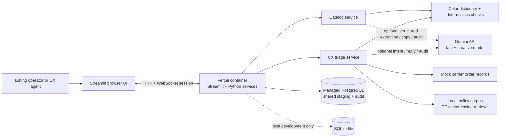
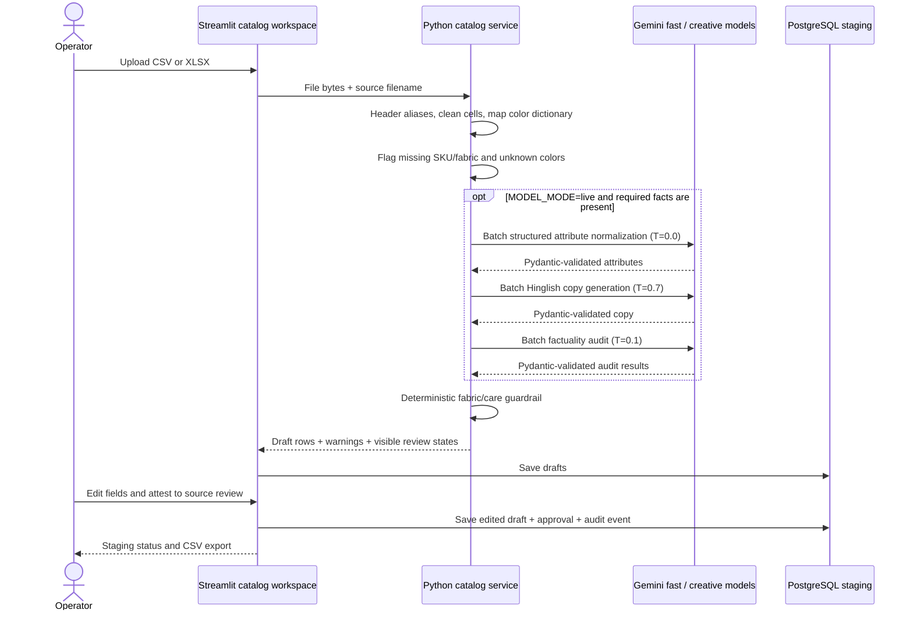
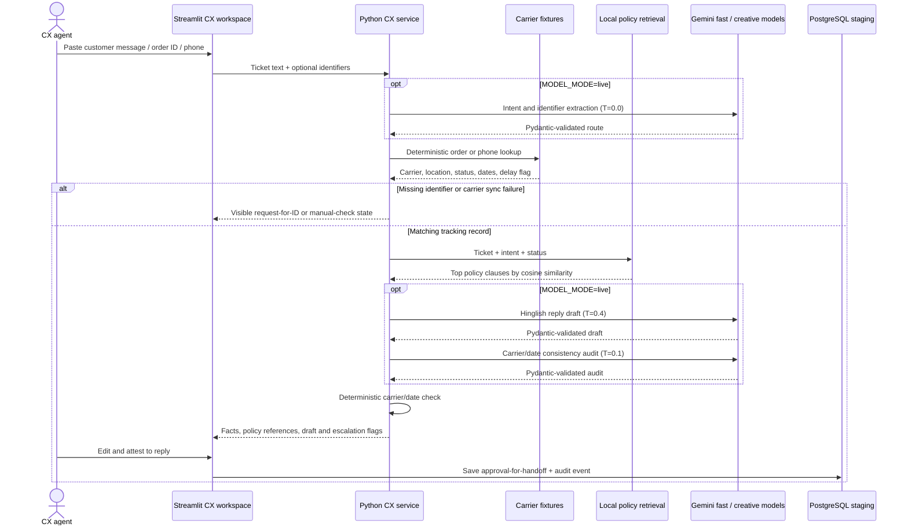

# Dhaga Ops architecture and data design

## High-level design

The MVP is a single Python application with a Streamlit operator interface and a service layer. A separate HTTP API is not needed for the two synchronous operator workflows. Vercel hosts the Streamlit HTTP service in a container; PostgreSQL holds shared workflow state. The browser holds the active Streamlit session and unsaved form edits, while saved listing and support drafts can be reopened from PostgreSQL.

The application has three execution modes:

- **Local demo:** deterministic parsing, copy templates, local policy retrieval, synthetic carrier records, and SQLite. No API key is required.
- **Local live:** the same services, with Gemini calls enabled through `MODEL_MODE=live`; SQLite remains the local database unless `DATABASE_URL` is set.
- **Vercel:** containerized Streamlit plus managed PostgreSQL. A missing `DATABASE_URL` is surfaced as a deployment configuration error because Vercel containers do not provide durable local files.

## Catalog data flow

The color dictionary maps 141 listed spellings to one of 24 values, including examples from the PRD and common variants. Confirm this local dictionary against Dhaga's authoritative 90-term list before a client pilot. An unknown shade remains unresolved until a listing operator chooses a master color. Live mode may offer a tentative model suggestion, but approval still requires operator confirmation. Missing SKU or fabric blocks a listing from approval. Common alpha sizes and ranges are normalized to XS–XXL; other supplier size labels remain as entered. LLM extraction is a judgment step for messy descriptions; price parsing, dictionary matching, schema checks, and factual comparisons stay deterministic.

## CX triage data flow

Order identifiers and phone numbers are extracted with regex as a deterministic first pass. The optional model classifies Hinglish intent and can recover missed context, but the app uses an exact fixture lookup for tracking. Missing identifiers, unmatched orders, carrier outages, and delays stay visible. Approval records a reviewed handoff draft; it does not send messages.

## Database design

PostgreSQL is the shared system of record for operator drafts and approval history. The same SQLAlchemy schema works in local SQLite for development. Carrier fixtures and demo policies are read-only files in this MVP; a future client integration can replace these adapters without changing the Streamlit workspace contract.

| Table | Purpose | Main fields |
|---|---|---|
| `listing_records` | Catalog row from upload through staging approval | `id`, `source_filename`, `vendor_sku`, `raw_payload`, `normalized_payload`, `generated_copy`, `compliance_passed`, `compliance_notes`, `issues`, `status`, `approved_by`, timestamps |
| `support_cases` | Ticket triage and agent handoff draft | `id`, `ticket_text`, `parsed_query`, `order_id`, `carrier_facts`, `policy_references`, `draft_reply`, `factual_verification_passed`, escalation fields, `status`, `approved_by`, timestamps |
| `audit_events` | Append-only operator actions for reviewability | `id`, `entity_type`, `entity_id`, `action`, `actor`, `detail`, `created_at` |

`raw_payload`, normalized fields, policy references, and carrier facts use JSON columns to retain source-shaped data without adding one database column for every vendor header. The catalog `status` values are `draft`, `needs_review`, `blocked`, and `approved`. CX values include `draft_ready`, `needs_identifier`, `not_found`, `sync_failed`, `needs_review`, and `approved_for_handoff`.

The schema is intentionally small and implemented with SQLAlchemy `create_all` at startup. Before production use, move schema evolution to Alembic migrations, add per-user identity and authorization, encrypt/retention-manage any real ticket PII, and add indexes based on actual query volume.

## Technology choices and guardrails

- **Streamlit + Python services:** fast operator UI and one-language service layer for a small internal workflow.
- **Vercel container:** `Dockerfile.vercel` starts Streamlit on the assigned `$PORT`. The application is a long-lived HTTP/WebSocket service; it requires Vercel container/WebSocket availability for the target account. See [Vercel container deployment](https://vercel.com/changelog/bring-your-dockerfile-to-vercel-functions) and [Vercel WebSocket guidance](https://vercel.com/docs/limits#websockets).
- **PostgreSQL:** durable shared approvals and case records. A local SQLite file is convenient for development only.
- **Pydantic boundaries:** Gemini returns JSON under a schema and the application validates again before using it. Provider or schema errors are surfaced in the UI.
- **Two model roles:** fast model for extraction/routing/evaluation; a separate creative model for catalog copy and CX response wording. Model IDs are configurable because provider availability changes.
- **Deterministic code:** CSV parsing, color lookup, order lookup, date arithmetic, delay flag, policy ranking, and final carrier/date checks.
- **Human approval:** no automatic publishing, customer send, refund, or production carrier mutation.

The local policy search represents each short policy as a term-count vector and ranks by cosine similarity. It is a small lexical RAG baseline, not an embedding model or `pgvector` system. The four supplied policy snippets are demonstration content and must be replaced with Dhaga-approved rules.

## Deployment and operational boundary

The current project is deployed at [dhaga-ops.vercel.app](https://dhaga-ops.vercel.app). Vercel Authentication and the app's shared password are both enabled. The deployment uses PostgreSQL for shared drafts and approvals; local SQLite is for development only. Gemini is optional, and example mode uses local rules and templates.

The container is configured by `Dockerfile.vercel`. Deployment environment variables include `DATABASE_URL` and `DHAGA_APP_PASSWORD`; keep credentials in Vercel's encrypted project settings. Do not remove either access gate as part of routine deployments. Actual live model latency and usage cost must be measured with the configured provider before quoting the PRD targets.
