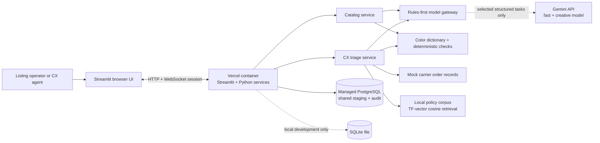

# Dhaga Ops architecture and data design

## High-level design

The MVP is a single Python application with a guided Streamlit operator interface and a service layer. The overview leads into product listings, customer messages, or saved approvals. Catalog review uses a searchable/filterable queue and one selected product; CX places the editable reply beside source order facts. A separate HTTP API is not needed for these two synchronous workflows. The Vercel configuration hosts Streamlit in a container; PostgreSQL holds shared workflow state. Unsaved editor content belongs to the browser session, while saved listing and reply edits can be reopened from the database.

The corrective [discovery and PRD review](product-discovery-and-prd.md) records the original evidence, problem ranking, assumptions, and acceptance criteria. It was written after implementation. The primary owner is Arpita for repetitive order-status support; Vivek owns the separate listing workflow. Production integrations and cold user studies have not been tested.



The application has three execution modes:

- **Local demo:** deterministic parsing, copy templates, local policy retrieval, synthetic carrier records, and SQLite. No API key is required.
- **Local live:** the same services, with Gemini calls enabled through `MODEL_MODE=live`; SQLite remains the local database unless `DATABASE_URL` is set.
- **Vercel:** containerized Streamlit plus managed PostgreSQL. A missing `DATABASE_URL` is surfaced as a deployment configuration error because Vercel containers do not provide durable local files.

The model gateway routes clear work to deterministic Python logic. Known color and size mappings, clear order intents, exact order lookup, carrier facts, policy retrieval, and final date/fact checks do not need a model. Gemini is reserved for unknown color suggestions, useful free-text product details, listing copy, unclear message intent, and replies that benefit from careful multilingual or sensitive wording. AI review is requested only for text that Gemini generated. In demo mode, all routes stay local.

## Catalog data flow

```mermaid
sequenceDiagram
    actor Operator
    participant UI as Streamlit catalog workspace
    participant Service as Python catalog service
    participant Models as Gemini fast / creative models
    participant DB as PostgreSQL staging
    Operator->>UI: Upload CSV or XLSX / load example
    UI->>Service: File bytes + source filename
    Service->>Service: Validate headers, keep readable rows, stable content/row IDs
    UI->>DB: Recover matching saved drafts and approvals
    Service->>Service: Process only new rows; map colors and sizes
    Service->>Service: Flag missing details, unknown color, invalid price
    opt MODEL_MODE=live and supplier notes contain useful free text plus missing attributes
      Service->>Models: Normalize only the missing attributes (T=0.0)
      Models-->>Service: Pydantic-validated attributes
    end
    opt MODEL_MODE=live and product details are ready
      Service->>Models: Batch Hinglish copy generation (T=0.7)
      Models-->>Service: Pydantic-validated copy
      Service->>Models: Batch factuality audit (T=0.1)
      Models-->>Service: Pydantic-validated audit results
    end
    Service->>Service: Deterministic fabric/care guardrail
    Service-->>UI: Review queue + warnings + separate row errors
    UI->>DB: Save new drafts; expose partial save failures
    Operator->>UI: Select one product; compare source; edit details/text
    UI->>Service: Refresh required fields, issues, and factual checks
    UI->>DB: Save draft or request reviewed approval
    DB->>DB: Recheck final copy, source identity, duplicate approved SKU
    DB-->>UI: Saved state + content-hash audit event
    UI-->>Operator: Saved approval and safe Unicode CSV export
```

The local color dictionary maps 141 synthetic/common spellings to one of 24 values. The brief describes around ninety spellings but supplies no authoritative mapping or palette; obtain it from Vivek before a client pilot. Unknown shades require an operator's color choice even when a model suggests a value. Supplier code, product name, source-supported fabric, and a palette color are required; a supplied price must be finite and nonnegative. Common alpha sizes/ranges normalize to XS–XXL; unrecognized vendor labels remain visible rather than being invented.

Imports accept up to 5 MB and 500 readable rows, handle quoted multiline CSV, reject ambiguous/duplicate headers, and report invalid rows without discarding readable ones. Those caps and the 50-row/90-second local test are implementation choices, not original PRD targets. File-content plus row identifiers let an identical reupload recover saved edits and approval rather than overwriting them with fresh generation. Approval protects saved supplier source identity, checks final edited text again inside the transaction, blocks an already approved supplier-code duplicate, and records a content hash. Missing model audit results cannot be treated as a successful audit; an explicit human comparison with the supplier source is required before that review gate can be cleared.

Save edits before switching products or workspaces. Partial import-save failures stay visible and offer a retry. Full saved-work lists are requested without the service's default 100-listing/50-case caps; overview totals use direct count queries. Draft batch export is labeled as work for review; approved listing export retains category, color, fabric, fit, care, sizes, price, highlights, occasions, keywords, source row/file, reviewer, and approval timestamp. Formula-like source text is prefixed as spreadsheet text in UTF-8-with-BOM CSV output.

## CX triage data flow

```mermaid
sequenceDiagram
    actor Agent as CX agent
    participant UI as Streamlit CX workspace
    participant Service as Python CX service
    participant Fixtures as Carrier fixtures
    participant RAG as Local policy retrieval
    participant Models as Gemini fast / creative models
    participant DB as PostgreSQL staging
    Agent->>UI: Paste customer message / order ID / phone
    UI->>Service: Ticket text + optional identifiers
    opt MODEL_MODE=live and local rules cannot identify the intent
      Service->>Models: Intent and identifier extraction (T=0.0)
      Models-->>Service: Pydantic-validated route
    end
    Service->>Fixtures: Exact order / unique phone lookup; validate identifier agreement
    Fixtures-->>Service: Carrier, location, status, supplied ETA, uncertainty
    alt Missing ID, conflicting match, tracking failure, cancellation or dispute
      Service-->>UI: Request-for-ID or internal follow-up with next step
    else Matching tracking record
      Service->>RAG: Ticket + intent + status
      RAG-->>Service: Top policy clauses by cosine similarity
      opt MODEL_MODE=live and the reply needs careful wording
        Service->>Models: Hinglish reply draft (T=0.4)
        Models-->>Service: Pydantic-validated draft
      end
      opt A reply was written by Gemini
        Service->>Models: Carrier/date consistency audit (T=0.1)
        Models-->>Service: Pydantic-validated audit
      end
      Service->>Service: Deterministic carrier/date check
      Service-->>UI: Facts, policy references, draft and escalation flags
      Agent->>UI: Edit reply; save draft or confirm review
      UI->>DB: Persist edited draft separately / request approval
      DB->>DB: Recheck final reply against saved facts and allowed state
      DB-->>UI: Saved result + content-hash audit event
    end
```

Literal order numbers and phone numbers are extracted with regular expressions first; model output cannot replace a literal source identifier. An explicit order ID does not fall through to a different phone match, supplied identifiers must agree, and a phone must match exactly one sample order. Multiple mentioned orders require an operator choice. Gemini assists only when routing needs interpretation or a supported reply benefits from careful wording. Cancellation and disputed delivery require a teammate, with no invented cancellation or doorstep-refusal instructions.

A shipment is overdue when its supplied carrier ETA is before today's India date and its status is still active. Transit duration alone does not establish delay; missing ETA is visible uncertainty and follow-up. The four-to-seven-day normal range from the brief is context, not a universal four-day alarm. Return eligibility/window and cancellation rules are not supplied by the client; example guidance retains only the source fact that refunds follow inspection.

Saved CX edits remain drafts until a separate reviewed approval. The service checks known order/courier/date/status/location/link markers and unverified promise expressions; the database checks final edited wording again against unchanged saved facts. These bounded checks and optional model evaluation do not prove all possible statements factually safe, so human source review remains mandatory. Approval only saves an internal handoff; a flag or downloadable internal follow-up note does not assign a courier task or send a message.

## Database design

PostgreSQL is the shared system of record for operator drafts and approval history. The same SQLAlchemy schema works in local SQLite for development. Carrier fixtures and demo policies are read-only files in this MVP; a future client integration can replace these adapters without changing the Streamlit workspace contract.

| Table | Purpose | Main fields |
|---|---|---|
| `listing_records` | Catalog row from upload through staging approval | `id`, `source_filename`, `vendor_sku`, `raw_payload`, `normalized_payload`, `generated_copy`, `compliance_passed`, `compliance_notes`, `issues`, `status`, `approved_by`, timestamps |
| `support_cases` | Ticket triage and agent handoff draft | `id`, `ticket_text`, `parsed_query`, `order_id`, `carrier_facts`, `policy_references`, `draft_reply`, `factual_verification_passed`, escalation fields, `status`, `approved_by`, timestamps |
| `audit_events` | Append-only draft and approval actions for reviewability | `id`, `entity_type`, `entity_id`, `action`, `actor`, `detail` with content hash, `created_at` |

`raw_payload`, normalized fields, policy references, and carrier facts use JSON columns to retain source-shaped data without adding one database column for every vendor header. The catalog `status` values are `draft`, `needs_review`, `blocked`, and `approved`. CX values include `draft_ready`, `needs_identifier`, `not_found`, `sync_failed`, `needs_review`, and `approved_for_handoff`.

The schema is intentionally small and implemented with SQLAlchemy `create_all` at startup. Before production use, move schema evolution to Alembic migrations, add per-user identity and authorization, encrypt/retention-manage any real ticket PII, and add indexes based on actual query volume.

Draft updates and approvals run in database transactions. A repeated identical approval is idempotent, a stale draft save cannot revoke approval, and approval reruns checks over final text instead of trusting a stale browser boolean. Reopened records carry an `updated_at` revision token; a conditional status/revision update rejects stale unapproved edits. PostgreSQL row locks protect same-record writes, and a transaction-level advisory lock on normalized supplier code protects duplicate approval across records. SQLite uses `BEGIN IMMEDIATE` to serialize writers. These checks use existing fields and require no schema migration. The reviewer name is self-reported; the shared password does not establish personal identity. Content hashes describe reviewed content but are not signatures or tamper-evident audit infrastructure.

## Technology choices and guardrails

- **Streamlit + Python services:** fast operator UI and one-language service layer for a small internal workflow.
- **Vercel container:** `Dockerfile.vercel` starts Streamlit on the assigned `$PORT`. The application is a long-lived HTTP/WebSocket service; it requires Vercel container/WebSocket availability for the target account. See [Vercel container deployment](https://vercel.com/changelog/bring-your-dockerfile-to-vercel-functions) and [Vercel WebSocket guidance](https://vercel.com/docs/limits#websockets).
- **PostgreSQL:** durable shared approvals and case records. A local SQLite file is convenient for development only.
- **Pydantic boundaries:** Gemini returns JSON under a schema and the application validates again before using it. Provider or schema errors are surfaced in the UI.
- **Rules-first model gateway:** checks task need and live-mode settings before every Gemini request. Model IDs are configurable because provider availability changes.
- **Deterministic code:** CSV parsing, color/size lookup, exact identifier matching, ETA/date arithmetic, policy ranking, final edited content checks, approval transactions, and CSV text-cell handling.
- **Human approval:** no automatic publishing, customer send, refund, or production carrier mutation.

The local policy search represents each short policy as a term-count vector and ranks by cosine similarity. It is a small lexical RAG baseline, not an embedding model or `pgvector` system. The four supplied policy snippets are demonstration content and must be replaced with Dhaga-approved rules.

## Deployment and operational boundary

The redesigned application is deployed at [dhaga-ops.vercel.app](https://dhaga-ops.vercel.app), retaining Vercel Authentication and the app's shared password and using PostgreSQL for shared drafts/approvals; local SQLite is for development only. Final revision `a2c5dd9` is `READY`; hosted sign-in, health, phone navigation, complete saved-work retrieval and exact-product recovery were verified. [Release verification](release-verification.md) records exact revisions and evidence. Fast model classification succeeded once. Creative generation showed mapped temporary AI-service unavailability and fell back locally even with LOW 3.8 thinking and a single-attempt 40-second request timeout. Successful creative generation and provider-quality measurements remain open; four synthetic drafts persisted without external sends/approvals or changes to existing products.

The container is configured by `Dockerfile.vercel`. Deployment environment variables include `DATABASE_URL` and `DHAGA_APP_PASSWORD`; keep credentials in Vercel's encrypted project settings. For optional live Gemini requests, set `MODEL_MODE=live` and `GEMINI_API_KEY`. Distinct defaults are `gemini-3.5-flash-lite` for extraction/routing/evaluation and `gemini-3.8-flash` for wording; environment overrides remain configurable. Free-tier data-use terms apply, so the demo uses synthetic data. Keep both access gates during routine deployments. Local timing tests do not establish live provider latency, production throughput, or measured savings.
